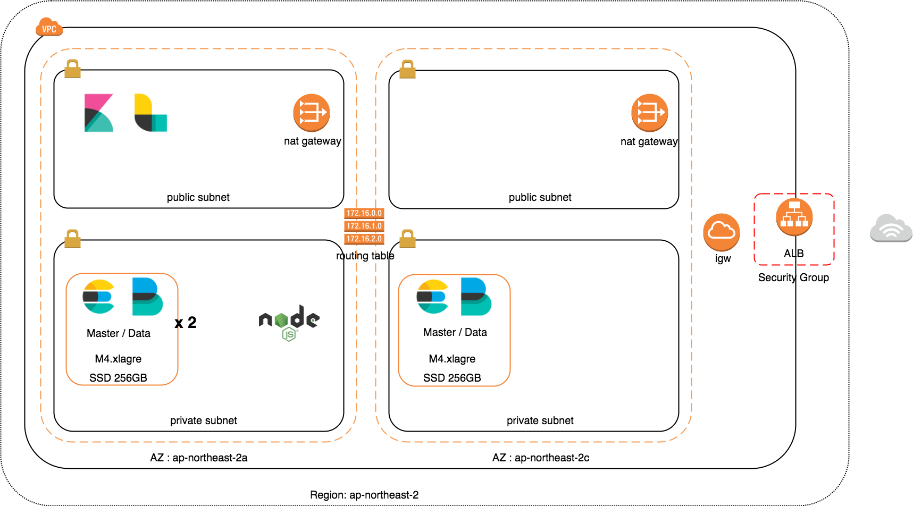

# Elasticsearch



* single master / data node elasticsearch

* 3 master / data node elasticsearch cluster

* Add data node to elasticsearch cluster

* metricbeat install

<br>

## ansible 수행 전 필요 사항

### ec2 instance

* es 설치할 ec2 instance 시작

* es 설치할 ec2 instance 에 ssh 접속이 가능한지 확인

  * es cluster ec2 instance private subnet에 존재 - 동일한 vpc 내 ec2 instance 에서 ansible 실행

  * es cluster ec2 instance public subnet에 존재 - 로컬에서 ansible 실행

* ansible repo git clone

* inventory 파일 생성 또는 수정 (inventories/dev/hosts / inventories/staging/hosts / inventories/prod/hosts)

  ```code
  # elasticsearch cluter list

  [Elasticsearch-0]
  {node-0 ip} ansible_ssh_private_key_file={pem file location}

  [Elasticsearch-1]
  {node-1 ip} ansible_ssh_private_key_file={pem file location}

  [Elasticsearch-2]
  {node-2 ip} ansible_ssh_private_key_file={pem file location}

  # 추가할 노드 아래에 추가하면 됨
  [Elasticsearch-3]
  {node-3 ip} ansible_ssh_private_key_file={pem file location}
  ```

* 접속 가능한지 확인

  * -i 옵션은 hosts 파일 경로를 지정해주는 옵션임

  ```shell
  ansible -i inventories/dev/hosts Elasticsearch-0 -m ping
  ```

* metricbeat 가 바라보는 kibana는 이미 설치 완료되어 있어야 한다. 순서는 `es -> kibana -> metricbeat`
  * **kibana 정상 동작 중이 (es 연결 완료) 아니면 kibana 정상 동작 후에 각 metricbeat 재시작해줘야 함.**
  * **metricbeat kibana 정상 접속 후에는 kibana 상태와 상관없이 metricbeat 정상 동작 함. 재시작 필요 없음**

<br>

## ES 설치

### es single

* `site.yml` 수정

  * `network.host` ec2 instance private ip 로 세팅 `network.host: {node-ip}`

  * `discovery.zen.ping.unicast.hosts` ec2 instance private ip 로 세팅 `discovery.zen.ping.unicast.hosts: "{node io}:9300"`

  * `hosts` 이름 세팅 inventories/*/hosts 에 세팅한 이름으로 수정 ex. `Elasticsearch-0`

* es single node ansible-playbook 실행

  * dev / staging / prod 중 원하는 환경에 설치

  ```shell
  ansible-playbook -i inventories/dev/hosts site.yml
  ```

* **metricbeat 필요할 경우 metricbeat playbook 별도로 구성하여 실행 해야함**

<br>

### es cluster 최초 구성 - 3 node (data, master)

준비된 ec2 instance 에 es cluster 초기 구성 세팅

#### es cluster 구성

* `site.yml` 수정

  * `network.host` ec2 instance private ip 로 세팅 `network.host: {node ip}`

  * `discovery.zen.ping.unicast.hosts` ec2 instance private ip 로 세팅

    ```code
    discovery.zen.ping.unicast.hosts: "{node-0 ip}:9300,{node-1 ip}:9301,{node-2 ip}:9302",
    ```

  * `hosts` 이름 세팅 inventories/*/hosts 에 세팅한 이름으로 수정 ex. `Elasticsearch-0`

* es cluster ansible playbook 실행

  * dev / staging / prod 중 원하는 환경에 설치

  ```shell
  ansible-playbook -i inventories/dev/hosts es-cluster-three.yml
  ```

#### metricbeat 설치

* **설치된 es cluster 와 kibana 정상 접속 됐는지 확인 필요, 접속 안되어 있을 경우, 각 node metric beat 재시작 해야 됨**

* `instance_name` ec2 instance host name

  ```code
  instance_name: "node-0"
  instance_name: "node-1"
  instance_name: "node-2"
  ```

* `metricbeat_hosts` es private ip

  ```code
  metricbeat_hosts: "{node-0 ip}:9200\", \"{node-1}:9201\", \"{node-2}:9202"
  ```

* `kibana_host` kibana host ip

  ```code
  kibana_host: "{kibana ip}:5601"
  ```

* `hosts` 이름 세팅 inventories/*/hosts 에 세팅한 이름으로 수정 ex. `Elasticsearch-0`

* metricbeat ansible playbook 실행

  ```shell
  ansible-playbook -i inventories/dev/hosts metric-three.yml
  ```

<br>

### es cluster 에 데이터 노드 추가

* 존재하는 cluster 에 데이터 노드 추가 시나리오 (metribeat 같이 설치)

* 기존 cluster node는 설정 변경이 필요 없음

* kibana와 es 가 붙어있는 상황이므로 metricbeat 동시 설치 가능

* `site.yml` 수정

  * `network.host` ec2 instance private ip 로 세팅 `network.host: {node-3 ip}`

  * `discovery.zen.ping.unicast.hosts` ec2 instance private ip 로 세팅

    * 기존 node 설정은 변경하지 않아도 됨.

    * 즉, 기존 노드들의 설정은 3대만 설정되어 있고, 현재 추가하는 노드에만 4대 설정 모두 있어도 node 4대 cluster 구조로 설정됨

    ```code
    discovery.zen.ping.unicast.hosts: "{node-0 ip}:9300,{node-1 io}:9301,{node-2 ip}:9302,{node-3 ip}:9303",
    ```

  * `hosts` 이름 세팅 inventories/*/hosts 에 세팅한 이름으로 수정 ex. `Elasticsearch-0`

  * `metricbeat_hosts` es private ip

    ```code
    metricbeat_hosts: "{node-0}:9200\", \"{node-1}:9201\", \"{node-2}:9202, \"{node-3}:9203"
    ```

  * `kibana_host` kibana host ip

    ```code
    kibana_host: "{kibana ip}:5601"
    ```

* es cluster에 data node 추가 ansible playbook 실행

  ```shell
  ansible-playbook inventories/dev/hosts add-data-node.yml
  ```
